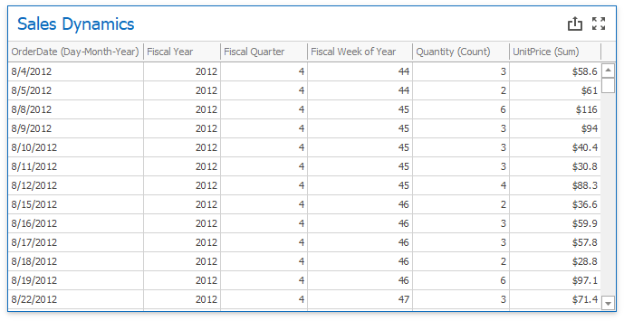

<!-- default file list -->
*Files to look at*:

* [Form1.cs](./CS/Dashboard_FiscalFunctions/Form1.cs)
* [Fiscal Functions](./CS/Dashboard_FiscalFunctions/Fiscal%20Functions)
<!-- default file list end -->
# Dashboard for WinForms - How to Calculate Fiscal Functions for Date-Time Data Fields.

This example shows how to create and register a custom functions that calculates fiscal year, quarter, and week from DateTime data fields.

## Overview

In this example, the [Grid](https://docs.devexpress.com/Dashboard/15150/winforms-dashboard/winforms-designer/create-dashboards-in-the-winforms-designer/dashboard-item-settings/grid) dashboard item displays the fiscal year, quarter and week for the corresponding date. 



The following expressions calculate fiscal values for the corresponding date.

| Calculated Field | Expression |
| --- | --- |
| Fiscal Year | ``` GetFiscalYear([OrderDate]) ``` |
| Fiscal Quarter | ``` GetFiscalQuarter([OrderDate]) ``` |
| Fiscal Week of Year | ``` GetFiscalWeekOfYear([OrderDate]) ``` |

To register fiscal functions you should write in code: 
```
CriteriaOperator.RegisterCustomFunction(new GetFiscalYearFunction([first day of year], [first month of year]));
CriteriaOperator.RegisterCustomFunction(new GetFiscalQuarterFunction([first day of year], [first month of year]));
CriteriaOperator.RegisterCustomFunction(new GetFiscalWeekOfYearFunction([first day of year], [first month of year], [CalendarWeekRule showing how to define the first week], [The first day of week]));
```
 
## Documentation
- [DateTime](https://docs.microsoft.com/ru-ru/dotnet/api/system.datetime?view=net-5.0)
- [Expression Constants, Operators, and Functions](https://docs.devexpress.com/Dashboard/400122/common-features/advanced-analytics/expression-constants-operators-and-functions)
