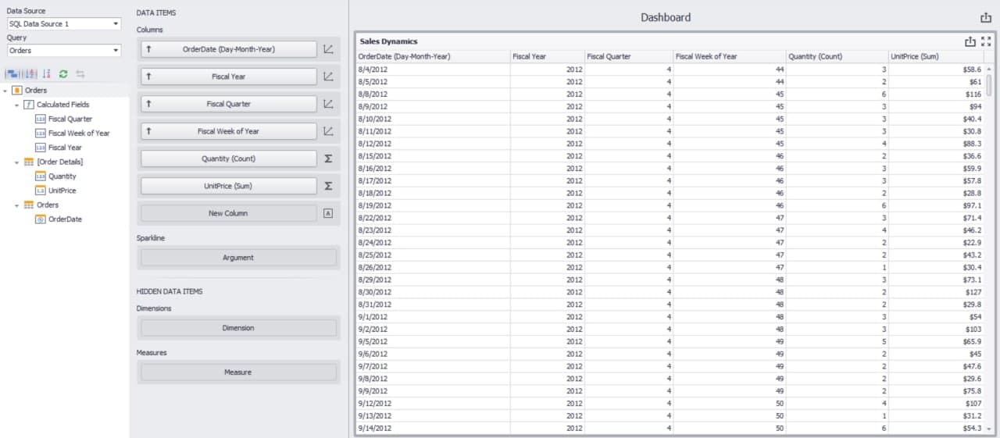

<!-- default file list -->
*Files to look at*:

* [Form1.cs](./CS/Dashboard_FiscalFunctions/Form1.cs)
* [Fiscal Functions](./CS/Dashboard_FiscalFunctions/Fiscal%20Functions)
<!-- default file list end -->
# Dashboard for WinForms - How to Calculate Fiscal Functions for Date-Time Data Fields.

This example shows how to find the number of a fiscal year, quarter, and week for date-time data fields.

## Overview

In this example, the [Grid](https://docs.devexpress.com/Dashboard/15150/winforms-dashboard/winforms-designer/create-dashboards-in-the-winforms-designer/dashboard-item-settings/grid) dashboard item displays the fiscal year, quarter and week for the corresponding date. 


The following expressions calculate fiscal values for the corresponding date.

| Calculated Field | Expression |
| --- | --- |
| Fiscal Year | ``` GetFiscalYear([OrderDate]) ``` |
| Fiscal Quarter | ``` GetFiscalQuarter([OrderDate]) ``` |
| Fiscal Week of Year | ``` GetFiscalWeekOfYear([OrderDate]) ``` |



## Example Structure

All Fiscal methods extend `GetFiscalDateFunction` and override the `GetFiscal` method used to calculate fiscal values. 

### Fiscal Year Function

Returns the year of input **DateTime** if it comes before a new fiscal year beginning date; otherwise returns the year plus 1.

### Fiscal Quarter Function

* If a difference between the input **DateTime** month, and the `startMonth` field not divisible by 3, the `GetFiscal` method returns the whole fraction of the difference by 3 plus 1; otherwise the fiscal quarter function calculates the result for the previous or next month of given **DateTime** depending on whether the input **DateTime** day is less or more than the `startDay` field.

### Fiscal Week Function

1. The `Beginning` method sets the start date of the first week in the input year.
2. If start date is more, than input date, the program calculates start date for the previouse year.
3. The function calculates the result as a sum of a difference between the start and input dates and the day of week offset from the first day of week divided by 7.
 
## Documentation
- [DateTime](https://docs.microsoft.com/ru-ru/dotnet/api/system.datetime?view=net-5.0)
- [Expression Constants, Operators, and Functions](https://docs.devexpress.com/Dashboard/400122/common-features/advanced-analytics/expression-constants-operators-and-functions)
